<div style="text-align:center">
<h3>Semi Illustrations</h3>
</div>

<table style="display: inline-table; text-align: center;">
  <tr>
    <td></td>
    <td></td>
    <td></td>
    <td></td>
    
  </tr>
  <tr>
    <td></td>
    <td></td>
    <td></td>
    <td></td>
  </tr>
</table>

</div>

##  📣 Introduce

Semantic Illustrations design by Semi Team

##  🚀 Getting Start

### install deps

```shell
npm install @douyinfe/semi-illustrations
```

### as a react component

```tsx
import { IllustrationIdle } from '@douyinfe/semi-illustrations';

ReactDOM.render(<IllustrationIdle />, root);
```

### as empty content

```tsx
import { Empty } from '@douyinfe/semi-ui';

ReactDOM.render(<Empty image={<IllustrationIdle />}></Empty>, root);

```


